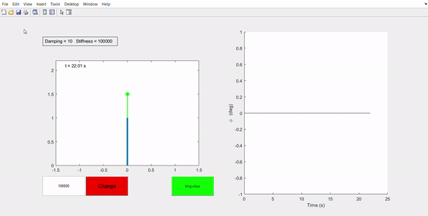
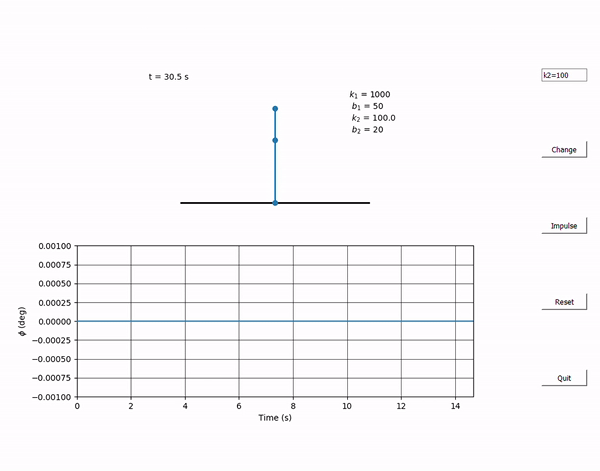

#Double Pendulum Visualization and Simulation
Simulation of double pendulum in 2 dimensions. This was created in order to investigate the behavior of the bicycle rider when the upper body is rigid in comparison to when it is more compliant. This was modeled by the use of a torsional spring damper in the hinge joint between the upper and lower rod. Additionally a spring damper is also inserted in the ground joint to model the balance behaviour of the bicycle. 
UIcontrol MATLab Implementation

PyQt5 Implementation

